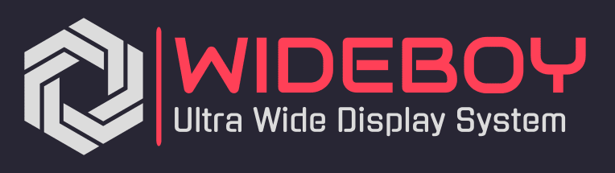
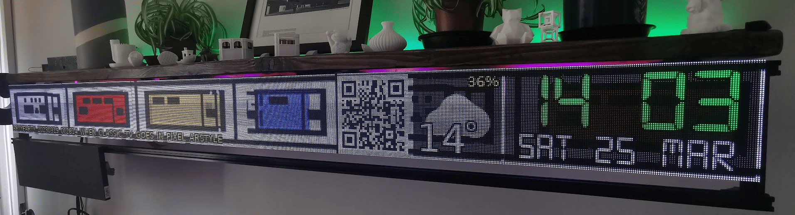
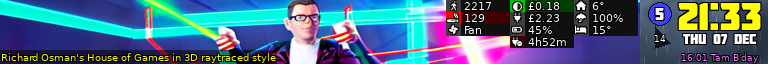
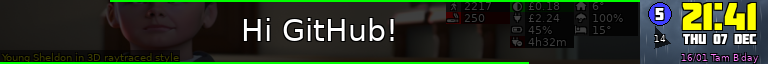
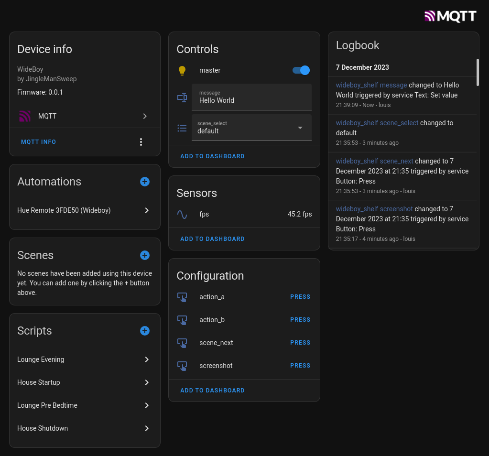
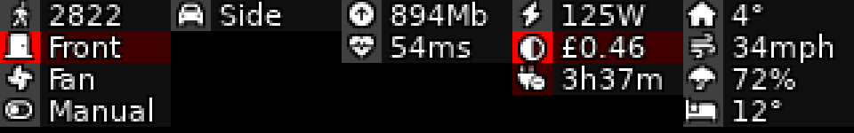

# WideBoy

    

WideBoy was designed to act as a unique home dashboard. It is a custom PyGame application designed to be displayed on HUB75 LED matrix panels, powered by a modern Raspberry Pi.

It displays basic information such as the current date and time, weather information and calendar events. An image carousel sprite is also included to showcase artwork or other images.

WideBoy has extensive [Home Assistant](https://www.home-assistant.io/) support in that it is fully remotely controllable via the [MQTT Discovery](https://www.home-assistant.io/integrations/mqtt/#mqtt-discovery) integration. Also, a comprehensive animated dynamic Entity grid sprite is provided, where each tile can be configured with it's own style, icon and visibility rules.

## Features

- :alarm_clock: Customisable dedicated Clock widget
- :calendar: Basic calendar with events and reminders
- :sunny: Weather summary and next hour forecast
- :camera: Background image slideshow (great with [ArtyFarty](https://github.com/jinglemansweep/artyfarty) AI art generator)
- :house: Animated dynamic Home Assistant entity grid
- :incoming_envelope: Announcements and notifications via [MQTT](https://en.wikipedia.org/wiki/MQTT)
- :satellite: Remote control via MQTT and [Home Assistant](https://www.home-assistant.io/)
- :white_square_button: QR code display for easy linking from mobile devices
- :strawberry: Optimised for [DietPi](https://dietpi.com/) running on a Raspberry Pi 4

## Screenshots

Default scene showing background artwork carousel sprite as well as dynamic Home Assistant entity tile grid sprite:

Default scene showing real-time incoming MQTT notification message:

Animated starfield scene:

Credits and debugging scene:

Home Assistant MQTT Device:

Home Assistant Entity Tile Grid:

## Usage

### MQTT

By default, WideBoy subscribes and publishes to topics starting with `wideboy/<device-id>`. The device ID is automatically generated from the devices MAC address but can be overridden (see [`settings.toml`](./settings.toml)).

If configured to use the same MQTT broker as Home Assistant, Wideboy will automatically advertise and configure itself using Home Assistant's MQTT Discovery mechanism.

Manual MQTT control is also possible, see below for example topic and message formats:

#### Power

    # Turn on
    mosquitto_pub -t "wideboy/example/master/set" -m '{"state": "ON"}'

    # Turn off
    mosquitto_pub -t "wideboy/example/master/set" -m '{"state": "OFF"}'

    # Set display brightness to 50% (100% = 255)
    mosquitto_pub -t "wideboy/example/master/set" -m '{"state": "ON", "brightness": 128}'

#### Scene Control

    # Advance to next scene
    mosquitto_pub -t "wideboy/example/scene_next/set" -m '{"state": "PRESS"}'

    # Switch to 'default' scene
    mosquitto_pub -t "wideboy/example/scene_select/set" -m "default"

    # Switch to 'starfield' scene
    mosquitto_pub -t "wideboy/example/scene_select/set" -m "starfield"

    # Trigger custom scene actions
    mosquitto_pub -t "wideboy/example/action_a/set" -m '{"state": "PRESS"}'
    mosquitto_pub -t "wideboy/example/action_b/set" -m '{"state": "PRESS"}'

#### Notifications / Alerts

    # Display 'Hello World' notification on display
    mosquitto_pub -t "wideboy/example/message/set" -m "Hello World"

#### Debugging

    # Save screenshot (to 'images/screenshots' directory)
    mosquitto_pub -t "wideboy/example/screenshot/set" -m '{"state": "PRESS"}'

#### Sensors

    # Current FPS
    mosquitto_sub -t "wideboy/example/fps/state"

## Components

### Hardware

- :strawberry: Raspberry Pi 4 (2GB RAM or higher) (see [RPi Locator](https://rpilocator.com/) for availability)
- :tophat: Active HUB75 Raspberry Pi Hat (e.g. [Electrodragon RGB Matrix Panel Driver Board](https://www.electrodragon.com/product/rgb-matrix-panel-drive-board-raspberry-pi/))
- :black_medium_square: 12 x 64x64 or 6 x 128x64 HUB75e LED matrix panels (e.g. [P2 P2.5 Indoor SMD2121 Full Color LED Display Module 1/32 Scan 320x160mm](https://www.aliexpress.com/item/32845686589.html))
- :zap: 5v power supply with support for 24A+ (e.g. [5v 40A Power Supply](https://www.amazon.co.uk/inShareplus-Universal-Regulated-Switching-Transformer/dp/B08QRCSTG4))

### Software

- :black_medium_square: [RPi RGB LED Matrix](https://github.com/hzeller/rpi-rgb-led-matrix) library to drive HUB75 LED panels with a Raspberry Pi
- :video_game: [PyGame CE](https://www.pyga.me/) Python based 2D graphics and gaming engine
- :electric_plug: Custom adaptor to reshape and convert PyGame RGB surface to LED matrix compatible pixel array (see [./wideboy/utils/display.py](./wideboy/utils/display.py))
- :penguin: [DietPi](https://dietpi.com/), a minimal lightweight Linux distribution designed for Raspberry Pi devices
- :snake: Python 3.x, [Paho MQTT Client](https://pypi.org/project/paho-mqtt/), [HomeAssistantAPI](https://github.com/GrandMoff100/HomeAssistantAPI)

## Installation

Fetch dependencies submodules:

    git submodule update --init --recursive

Build `rpi-rgb-led-matrix` Python bindings:

    cd lib/rpi-rgb-led-matrix
    make build-python

## Configuration

Project configuration is provided using [Dynaconf](https://www.dynaconf.com/), meaning that configuration can be provided using one or more TOML files, but can also be overridden at runtime using environment variables. For more information, see [`config.py`](./wideboy/config.py).

The provided [`settings.toml`](./settings.toml) details all the available options, but they are all commented out. The preferred method of configuration is to override any settings by creating a `settings.local.toml` and/or a `secrets.toml` (for sensitive values). Both of these files, if they exist, will be used, but should not be stored in source control and are therefore ignored using `.gitignore`.

## Development

Create a Python 3.x virtual environment, and install project dependencies:

    python3 -m venv venv
    . venv/bin/activate
    pip install --upgrade pip poetry
    poetry install

## Running

To run the project:

    . venv/bin/activate
    python3 -m wideboy
