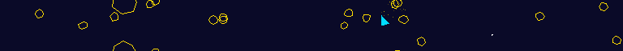
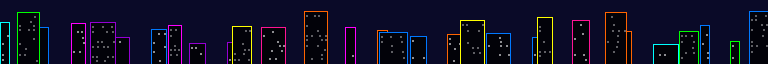
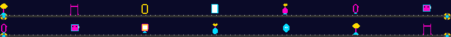
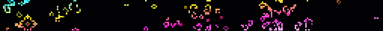
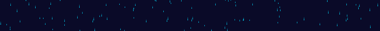
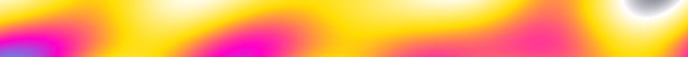
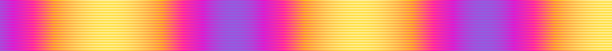
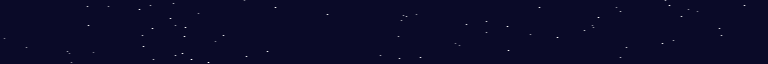
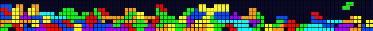
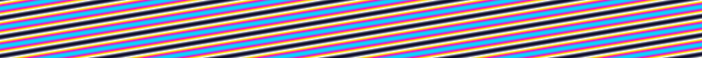

# WideBoy


768x64 RGB LED matrix dashboard for Raspberry Pi.

Drives 6x 128x64 HUB75 panels (logical 768x64) via a Pi 4 + Electrodragon v2 HAT.
Displays a clock and Home Assistant entity tile grid over animated procedural backgrounds.

## Documentation

- [Installation](docs/install.md) -- Pi setup, rpi-rgb-led-matrix build, systemd, wiring
- [Configuration](docs/config.md) -- settings reference, scene format, MQTT entities

## Effects

24 procedural background effects with tag-based selection and auto-rotation.

### Airwolf


Airwolf helicopter fly-by. Tags: `nostalgic`, `energetic`. Palette: `mono`.

### Asteroids



Retro vector asteroids game. Tags: `game`, `retro`, `energetic`. Palette: `mono`.

### Aurora


Undulating aurora borealis bands. Tags: `abstract`, `calm`. Palette: `ocean`.

### Boids


Flocking boids simulation. Tags: `nature`, `calm`. Palette: `neon`.

### Breakout


Paddle-and-ball brick breaker. Tags: `game`, `retro`, `energetic`. Palette: `neon`.

### Bubbles


Rising iridescent bubbles. Tags: `particle`, `calm`. Palette: `ocean`.

### Cityscape



Procedural city skyline. Tags: `nostalgic`, `calm`. Palette: `neon`.

### Conveyor



Scrolling conveyor belt. Tags: `linear`, `retro`. Palette: `neon`.

### Equalizer


Audio spectrum bar visualiser. Tags: `retro`, `energetic`. Palette: `neon`.

### Flappy


AI-controlled flappy bird with organic movement. Tags: `game`, `retro`. Palette: `neon`.

### Gradient


Smooth animated colour gradient. Tags: `abstract`, `calm`. Palette: `ocean`.

### Life



Conway's Game of Life cellular automaton. Tags: `abstract`, `calm`. Palette: `neon`.

### Lightning


Branching lightning bolts. Tags: `energetic`, `dark`. Palette: `neon`.

### Mandelbrot


Animated Mandelbrot zoom. Tags: `abstract`, `geometric`. Palette: `sunset`.

### Matrix Rain



Falling green code rain. Tags: `retro`, `dark`. Palette: `forest`.

### Plasma



Classic plasma colour cycling. Tags: `abstract`, `calm`. Palette: `neon`.

### Rings


Expanding concentric ring ripples. Tags: `geometric`, `calm`. Palette: `sunset`.

### Scanlines



CRT-style scanline sweep. Tags: `retro`, `dark`. Palette: `neon`.

### Slosh


Fluid sloshing liquid simulation. Tags: `liquid`, `calm`. Palette: `ocean`.

### Snow



Falling snowflake particles. Tags: `particle`, `calm`. Palette: `mono`.

### Starfield


3D star warp fly-through. Tags: `particle`, `calm`, `dark`. Palette: `mono`.

### Tetris



AI-controlled falling Tetris blocks. Tags: `game`, `retro`. Palette: `neon`.

### Traffic


Animated traffic jam scene. Tags: `linear`, `energetic`. Palette: `neon`.

### Waves



Sine-wave interference patterns. Tags: `abstract`, `calm`. Palette: `forest`.

## Features

- **24 procedural effects** with tag-based selection and auto-rotation
- **Custom tags** assignable to any effect via settings YAML for personalised groupings
- **Home Assistant integration** via WebSocket (entity state) and MQTT (control)
- **Live control** from HA: on/off, brightness, effect, palette, tag filter, scene
- **Scene-based config** in YAML with layered settings and env var overrides
- **Emulator mode** for local development (no Pi required)
- **Smooth transitions** between effects (1-second crossfade each minute)

## Quick start

```bash
uv venv && uv pip install -e ".[dev]"
python -m wideboy                            # emulator at http://localhost:8888
python -m wideboy --test-pattern             # test pattern (verify panel wiring)
```

Requires Python 3.11+. The emulator uses [RGBMatrixEmulator](https://github.com/dfirestone/RGBMatrixEmulator).

## Project layout

```
wideboy/
├── settings.yml              # default config
├── secrets.yml.example       # template for HA credentials
├── scenes/default.yml        # active scene
├── palettes.yml              # colour palettes
├── fonts/                    # white-rabbit, bitstream-vera, fontawesome-solid
├── assets/backgrounds/       # user-provided slideshow images
├── systemd/                  # systemd service unit
├── scripts/                  # utility scripts (screenshot capture)
└── src/wideboy/
    ├── __main__.py           # entrypoint + main loop
    ├── config.py             # pydantic-settings models
    ├── display/              # emulator + hardware backends + remap
    ├── core/                 # scene loader, factory, layer base
    ├── backgrounds/          # image, slideshow, gif, procedural (24 effects)
    ├── widgets/              # clock, tile_grid
    ├── services/             # HA WebSocket + MQTT/HASS
    └── render/               # text, icons, palette, brightness
```
